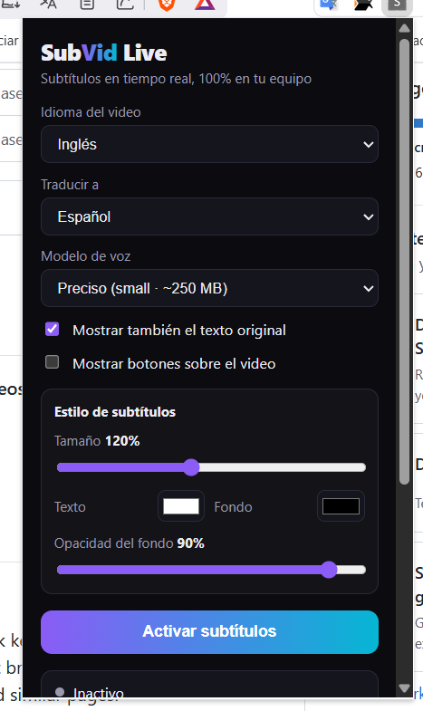
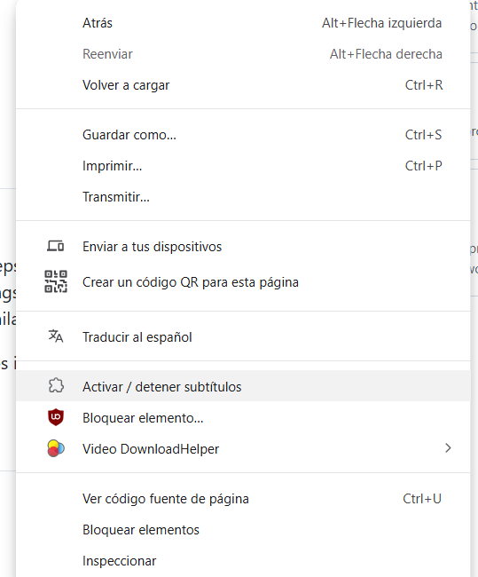
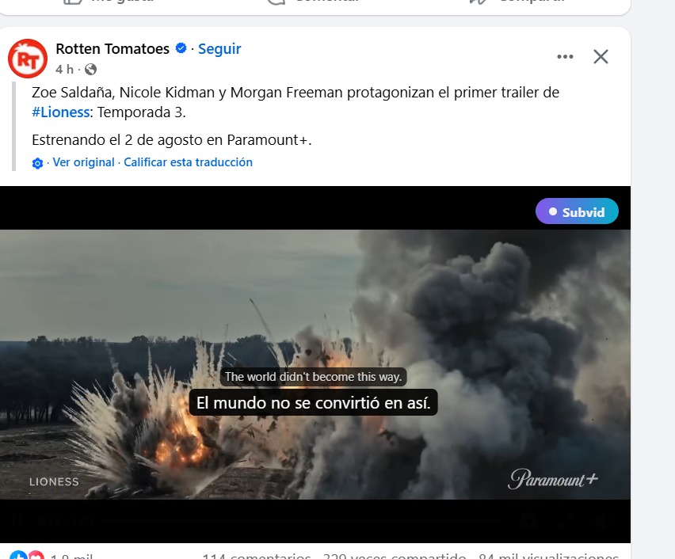

# SubVid Live — extensión de Chrome

Subtítulos y traducción **en tiempo real** para videos de YouTube, X, Facebook,
Instagram y cualquier sitio con video. Misma filosofía que
[subvid.app](../README.md): **sin APIs de pago y sin backend** — todo el
procesamiento (Whisper + traducción) ocurre localmente en tu navegador.

La descarga de videos se separó en la extensión independiente
[`video-downloader-extension/`](../video-downloader-extension/). SubVid Live ya
no solicita permisos de red globales ni de descargas.

## Capturas

### Panel de configuración

Desde el popup puedes elegir el idioma del video, el idioma de traducción, el
modelo de voz (Whisper), mostrar el texto original, ocultar los botones sobre el
video y personalizar tamaño, color y opacidad de los subtítulos.



### Activación con clic derecho

Clic derecho en cualquier página → **Activar / detener subtítulos**. Esta acción
también concede el permiso `activeTab` que necesita la captura de audio. El
menú muestra el logo de la extensión.



### Subtítulos sobre el video

Los subtítulos se dibujan encima del reproductor: línea original arriba y
traducción abajo (opcional). El botón flotante **Subvid** permite activar o
detener sin abrir el popup; puedes arrastrarlo para no tapar los controles.



## Cómo funciona

1. Pulsas **Activar subtítulos** en el popup de la extensión.
2. El service worker captura el audio de la pestaña con `chrome.tabCapture`
   (funciona con cualquier video, incluso con audio protegido por CORS).
3. Un documento offscreen trocea el audio en fragmentos (con detección de
   pausas) y los transcribe con **Whisper** vía transformers.js
   (WebGPU si está disponible, WASM si no).
4. Cada frase se traduce localmente, en este orden de preferencia:
   - **Translator API de Chrome** (Chrome 138+, modelos locales del navegador)
   - **MarianMT** (`Xenova/opus-mt-*`) para pares comunes
   - **NLLB-200** como último recurso
5. El content script dibuja los subtítulos superpuestos sobre el video.

La primera vez se descargan los modelos desde Hugging Face y quedan en la
caché del navegador; después funciona sin red (salvo el propio video).

## Desarrollo

```bash
cd extension
npm install
npm run build   # genera dist/
```

## Instalar en Chrome

1. Abre `chrome://extensions`
2. Activa **Modo de desarrollador**
3. **Cargar descomprimida** → selecciona la carpeta `extension/dist`
4. Abre un video, pulsa el icono de la extensión y **Activar subtítulos**

### Activación rápida

- Botón **Subvid** flotante sobre el video.
- Clic derecho en la página → **Activar / detener subtítulos**.
- Atajo **Ctrl+Shift+Y** (configurable en `chrome://extensions/shortcuts`).

Nota: Chrome exige que la extensión haya sido "invocada" en la pestaña
(activeTab) antes de poder capturar audio. El menú contextual, el atajo y el
icono cuentan como invocación; el botón CC funciona a partir de ese momento.

Los subtítulos se pueden **arrastrar verticalmente** para no tapar nada; la
posición se recuerda.

## Ajustar la latencia de los subtítulos

La extensión acumula audio hasta detectar una pausa, transcribe con Whisper y
**muestra el original de inmediato**; la traducción actualiza el mismo subtítulo
en paralelo (no bloquea el siguiente ASR).

Hay dos modos en el popup:

| Modo | Uso | Troceado (aprox.) | Cola ASR | Contexto MT |
|---|---|---|---|---|
| **Live** (default) | casi tiempo real | MIN adaptativo 1.8–3.0 s, MAX 6 s, silencio 0.6 s | 1 (descarta atrasados) | 2 cues |
| **Quality** | más precisión | MIN 2.2–3.5 s, MAX 7 s, silencio 0.7 s | 2 | 3 cues |

El MIN es **adaptativo** y prioriza no cortar ideas:

- Pausa muy clara (~0.75 s) → puede cerrar desde **1.8 s**.
- Conversación normal → **~2.4 s** + silencio **0.6 s** (las comas no cortan).
- Habla continua → **~3.0 s**.
- Tras cada corte se reutiliza **~0.7 s** de audio (overlap) en el siguiente fragmento.

El checkbox **Mostrar latencia** enseña el panel Audio→Chunk / Queue / ASR / TR / First / Final.

## Notas

- Modelo *tiny* recomendado para tiempo real en equipos sin WebGPU; *base* o
  *small* dan mejor calidad si tu equipo va sobrado.
- La latencia típica es de unos segundos (tamaño del fragmento + inferencia).
- Si vas con retraso, la extensión descarta fragmentos antiguos para mantenerse
  "en vivo".
- El audio de la pestaña se sigue escuchando con normalidad mientras se captura.
