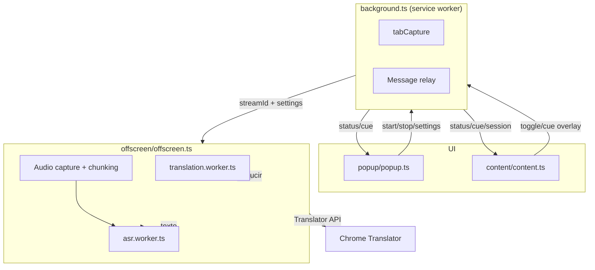

# SubVid Live — Referencia técnica

Documento de referencia para desarrolladores y agentes de IA. Describe tecnologías,
versiones, arquitectura, modelos, constantes y convenciones del paquete
`extension/` sin depender del README de usuario.

**Última revisión:** agosto 2026 · **Versión de la extensión:** 1.0.0

---

## 1. Resumen

SubVid Live es una extensión **Chrome Manifest V3** que:

1. Captura el **audio de la pestaña activa** (`chrome.tabCapture`).
2. Trocea el audio en fragmentos y lo transcribe con **Whisper** (transformers.js).
3. Traduce cada frase con el **Traductor de Chrome**, **MarianMT** o **NLLB-200**.
4. Superpone subtítulos sobre el `<video>` detectado (content script).

Todo el procesamiento de IA es **local en el navegador**. No hay backend ni API keys.
Los modelos se descargan de Hugging Face en el primer uso y se cachean.

> Desde julio de 2026, la detección y descarga de videos vive en
> `video-downloader-extension/`. SubVid Live se limita a subtítulos y traducción.

---

## 2. Stack y versiones

### 2.1 Runtime y build

| Tecnología | Versión (lockfile) | Uso |
|---|---|---|
| Chrome / Chromium | ≥ **116** (`minimum_chrome_version`) | MV3, tabCapture, offscreen, Translator API |
| TypeScript | **5.9.3** | Tipado estático |
| Vite | **6.4.3** | Bundler |
| @crxjs/vite-plugin | **2.5.0** | Empaquetado MV3 + HMR en dev |
| sharp | **0.34.3** | Generación de iconos PNG desde SVG (`npm run icons`) |

### 2.2 IA y audio

| Paquete | Versión (lockfile) | Archivo de declaración | Uso |
|---|---|---|---|
| @huggingface/transformers | **3.8.1** | `extension/package.json` | Pipelines Whisper y traducción (transformers.js) |
| onnxruntime-web | **1.22.0-dev.20250409** (transitivo) | `extension/package-lock.json` | Inferencia ONNX en WASM/WebGPU |

#### transformers.js ≠ transformers (Python)

Son **dos proyectos distintos** de Hugging Face:

| Proyecto | Paquete | Versión actual en este monorepo | Repo |
|---|---|---|---|
| **Transformers.js** (navegador) | `@huggingface/transformers` (npm) | Extensión: **3.8.1** · Web app: **4.2.0** | [transformers.js](https://github.com/huggingface/transformers.js) (último npm: **4.2.0**) |
| **Transformers** (Python) | `transformers` (pip) | *no usado en la extensión* | [transformers](https://github.com/huggingface/transformers) (último pip: **5.12.0**) |

La extensión usa **3.8.1** de forma intencional (no por desactualización). Ver
**§2.3** para el historial del pin y los riesgos de subir a 4.x.

**Dónde se importa transformers.js:**

- `extension/src/offscreen/asr.worker.ts`
- `extension/src/offscreen/translation.worker.ts`

**Configuración del runtime ONNX en workers:** `env.allowLocalModels`, `env.useBrowserCache`,
`onnxWasm.wasmPaths`, `onnxWasm.numThreads` — en ambos workers.

### 2.3 Pin en 3.8.1 — por qué no usar 4.2.0 (aún)

#### Historial en este proyecto

1. La extensión se creó con `^3.8.1` (commit `9ba5699`, jun 2026).
2. Se probó **transformers.js v4** y apareció el error exacto:
   `TransposeDQWeightsForMatMulNBits Missing required scale` al cargar MarianMT /
   NLLB (y también en el decoder de Whisper con WebGPU).
3. Se **revirtió a 3.8.1** como fix estable. Issues relacionados:
   - [transformers.js#1635](https://github.com/huggingface/transformers.js/issues/1635)
   - [#1637](https://github.com/huggingface/transformers.js/issues/1637)
   - [#1667](https://github.com/huggingface/transformers.js/issues/1667)
4. Más tarde se probó **M2M100 + WebGPU** en 3.8.1; el navegador se colgó → se
   mantuvo Marian/NLLB en 3.8.1.

La **web app** del monorepo (`package.json` raíz) sí usa **4.2.0**, pero en muchos
flujos prioriza Chrome Translator / Prompt API y no depende tanto del fallback
local Marian/NLLB como la extensión en Brave.

#### Diferencias relevantes 3.8.1 → 4.2.0

| Área | v3.8.1 (extensión) | v4.2.0 (web app / npm latest) |
|---|---|---|
| onnxruntime-web | `1.22.0-dev.20250409` | `1.26.0-dev.20260416` |
| Tokenizers | integrados en el paquete | subpaquete `@huggingface/tokenizers` |
| WebGPU | JSEP en JS | runtime WebGPU reescrito en C++ |
| Bundle | más grande | ~53 % más pequeño (export default) |
| API nueva | — | `ModelRegistry`, `env.useWasmCache`, `env.logLevel`, `progress_total` |
| Modelos nuevos | Whisper, Marian, NLLB, SAM, TTS… | + LLMs (Gemma, Qwen, DeepSeek…), no usados aquí |
| v4.1 | — | dtypes `q1`, `q2`, `q1f16`, `q2f16` |
| v4.2 | — | tool calling en pipelines de texto, `inputMetadata` |

La API que usa SubVid Live **no cambia** en los workers:

```javascript
await pipeline("automatic-speech-recognition", "Xenova/whisper-tiny", { device: "webgpu" })
await pipeline("translation", "Xenova/opus-mt-en-es")
await pipeline("translation", "Xenova/nllb-200-distilled-600M", { /* src_lang, tgt_lang */ })
```

#### Riesgos concretos al subir la extensión a 4.2.0

| Riesgo | Severidad | Detalle |
|---|---|---|
| **Regresión MatMulNBits** en Marian/NLLB/M2M100 | **Alta** | Reproducible en 4.0.1–4.2.0 ([#1635](https://github.com/huggingface/transformers.js/issues/1635)). Rompe fallback local en Brave. |
| **webInitChain envenenada** | **Alta** | Tras fallo ONNX, reintentos en el mismo worker heredan el error ([#1635](https://github.com/huggingface/transformers.js/issues/1635)). ASR ya recrea worker; traducción no. |
| **Desalineación ORT .mjs / .wasm** | **Media** | `vite.config.ts` debe copiar ORT **1.26** emparejado con transformers 4.x. |
| **Whisper WebGPU** | **Media** | Mismo error en `embed_tokens`; mitigado en 3.8.1 con fallback WASM + worker nuevo. |
| **M2M100 418M + WebGPU** | **Alta** | Congeló el navegador en pruebas previas (3.8.1). |
| **Modelos Xenova vs onnx-community** | **Baja** | v4 favorece `onnx-community/*`; verificar `Xenova/*` antes de migrar. |

#### Cuándo actualizar

- Cuando Hugging Face cierre la regresión ORT seq2seq ([#1635](https://github.com/huggingface/transformers.js/issues/1635)).
- Tras probar: Marian `en→es`, NLLB `ja→es`, Whisper `tiny` WASM + WebGPU en extensión.
- Regenerar lockfile, actualizar copia WASM en `vite.config.ts`, recrear worker de traducción en fallback.
- Limpiar caché del navegador al cambiar major version.

#### Archivos a tocar en una migración futura

| Archivo | Cambio |
|---|---|
| `extension/package.json` | `"@huggingface/transformers": "^4.2.0"` |
| `extension/package-lock.json` | Regenerar |
| `extension/vite.config.ts` | ORT WASM 1.26 |
| `extension/src/offscreen/translation.worker.ts` | Recrear worker en fallback |
| `extension/src/offscreen/offscreen.ts` | Paridad con retry de `src/scripts/translation.worker.ts` |

### 2.4 Comandos

```bash
cd extension
npm install
npm run icons   # regenera icons/icon{16,32,48,128}.png
npm run build   # icons + vite build → dist/
npm run dev     # desarrollo con recarga
npm run typecheck
```

**Salida de build relevante:**

- `dist/` — extensión cargable en `chrome://extensions`
- `dist/wasm/` — binarios `ort-wasm-simd-threaded*` (onnxruntime)

---

## 3. Arquitectura



### 3.1 Componentes

| Archivo | Contexto | Responsabilidad |
|---|---|---|
| `manifest.config.ts` | Extensión | Permisos, CSP, iconos, content scripts |
| `src/background.ts` | Service worker | Sesión, tabCapture, offscreen, menú contextual |
| `src/offscreen/offscreen.ts` | Documento offscreen | Orquestación: captura, colas ASR/traducción, cues |
| `src/offscreen/chunkConfig.ts` | Offscreen | Constantes de troceado adaptativo |
| `src/offscreen/pipelineQueues.ts` | Offscreen | Colas seriales ASR + traducción (solapadas) |
| `src/offscreen/translationProvider.ts` | Offscreen | Cascada Chrome Translator → Marian → NLLB |
| `src/offscreen/glossary.ts` | Offscreen | Glosario de sonidos + limpieza de artefactos |
| `src/offscreen/pcm-capture.worklet.js` | AudioWorklet | Captura PCM (fallback: ScriptProcessor) |
| `src/offscreen/asr.worker.ts` | Web Worker | Pipeline Whisper (ASR) |
| `src/offscreen/translation.worker.ts` | Web Worker | MarianMT / NLLB |
| `src/content/content.ts` | Página (all_frames) | Overlay, FAB, upsert de cues por `cueId` |
| `src/popup/popup.ts` | Popup | Configuración, estado y toggle |
| `src/shared/types.ts` | Compartido | Tipos, defaults y `Settings` |
| `src/shared/languages.ts` | Compartido | Modelos HF, idiomas, metadatos de traductor |
| `vite.config.ts` | Build | Copia ort-wasm a `dist/` |

### 3.2 Paridad con la web app

La extensión reutiliza la misma filosofía y tablas de modelos que
`src/scripts/languages.ts` del monorepo (subvid.app). Los workers están adaptados
de `src/scripts/transcriber.worker.ts` y `src/scripts/translation.worker.ts`.

### 3.3 ¿Por qué `tabCapture` + documento offscreen?

Son dos piezas complementarias; ninguna sustituye a la otra.

#### `chrome.tabCapture` (service worker → `background.ts`)

- **Qué hace:** obtiene un `streamId` para capturar el **audio de la pestaña**
  donde suena el video (YouTube, Facebook, etc.), incluso cuando el audio del
  `<video>` está protegido por CORS.
- **Dónde:** `startCapture()` llama a `chrome.tabCapture.getMediaStreamId({ targetTabId })`.
- **Por qué no basta solo:** el service worker MV3 **no puede** reproducir audio,
  crear `AudioContext`, ni ejecutar workers pesados de forma fiable. Solo
  orquesta permisos y mensajes.

#### Documento offscreen (`chrome.offscreen` → `offscreen.ts`)

- **Qué hace:** página oculta de la extensión con permiso `USER_MEDIA` + `WORKERS`
  donde sí se puede:
  1. Abrir el `MediaStream` real con el `streamId` de tabCapture.
  2. Procesar audio (`AudioContext`, troceado, detección de silencio).
  3. Ejecutar workers con Whisper y Marian/NLLB (WASM/WebGPU).
- **Dónde se crea:** `ensureOffscreen()` en `background.ts` → URL
  `src/offscreen/offscreen.html`.
- **Ciclo de vida:** se abre al iniciar subtítulos; `closeOffscreenDocument()` al
  detener o recargar la extensión.

```text
Usuario activa subtítulos
  → background: tabCapture.getMediaStreamId()
  → background: offscreen.createDocument()
  → offscreen: getUserMedia({ chromeMediaSource: "tab", chromeMediaSourceId })
  → offscreen: trocea audio → workers IA → subtítulos al content script
```

Sin tabCapture no hay audio del video. Sin offscreen no hay dónde procesarlo en MV3.

---

## 4. Modelos de IA

### 4.1 Whisper (transcripción)

Fuente: `src/shared/languages.ts` → `ASR_MODELS`

| Clave UI | Modelo Hugging Face | Tamaño aprox. |
|---|---|---|
| `tiny` (default) | `Xenova/whisper-tiny` | ~40 MB |
| `base` | `Xenova/whisper-base` | ~80 MB |
| `small` | `Xenova/whisper-small` | ~250 MB |

**Worker:** `asr.worker.ts`

- Pipeline: `automatic-speech-recognition`
- Opciones de inferencia: `language` (ISO 639-1 o `null`), `task: "transcribe"`
- Dispositivo: `webgpu` si `navigator.gpu` existe; fallback a WASM recreando el worker
- `env.allowLocalModels = false`, `env.useBrowserCache = true`
- WASM: `numThreads = 1` (sin `crossOriginIsolated` en páginas de extensión)
- Rutas WASM: `${worker.origin}/wasm/`

### 4.2 Traducción (cascada)

Orden de selección en `offscreen.ts` → `ensureTranslation()`:

```text
1. Chrome Translator API (self.Translator)
2. MarianMT si existe par en MARIAN_TRANSLATION_MODELS
3. NLLB-200 distilled 600M para el resto
```

#### Chrome Translator API

- Requiere **Chrome 138+** con modelos de traducción locales instalados.
- **No disponible** en Brave ni en navegadores sin la API.
- Se precarga desde el popup al pulsar «Activar subtítulos» (gesto de usuario).
- Comprueba `Translator.availability({ sourceLanguage, targetLanguage })`.

#### MarianMT (`Xenova/opus-mt-*`)

Pares soportados (bidireccionales):

| Par | Modelo |
|---|---|
| en ↔ es | `opus-mt-en-es` / `opus-mt-es-en` |
| en ↔ fr | `opus-mt-en-fr` / `opus-mt-fr-en` |
| en ↔ de | `opus-mt-en-de` / `opus-mt-de-en` |
| en ↔ pt | `opus-mt-en-pt` / `opus-mt-pt-en` |
| en ↔ it | `opus-mt-en-it` / `opus-mt-it-en` |
| en ↔ nl | `opus-mt-en-nl` / `opus-mt-nl-en` |
| en ↔ ru | `opus-mt-en-ru` / `opus-mt-ru-en` |

#### NLLB-200

| Campo | Valor |
|---|---|
| **ID en código** | `NLLB_MODEL` en `src/shared/languages.ts` |
| **Modelo ONNX (HF)** | [`Xenova/nllb-200-distilled-600M`](https://huggingface.co/Xenova/nllb-200-distilled-600M) |
| **Modelo base (PyTorch)** | [`facebook/nllb-200-distilled-600M`](https://huggingface.co/facebook/nllb-200-distilled-600M) |
| **Familia** | NLLB-200 (*No Language Left Behind*, Meta, 2022) |
| **Variante** | **distilled 600M** (~600 millones de parámetros) |
| **Formato en extensión** | ONNX cuantizado para transformers.js (`pipeline('translation', ...)`) |
| **Pipeline HF** | `text2text-generation` / arquitectura M2M100 |
| **Idiomas del modelo** | ~200 (la extensión solo expone 15 en UI) |
| **Licencia** | CC-BY-NC 4.0 (uso no comercial; ver HF) |
| **Códigos NLLB en app** | `LANGS[code].nllb` en `src/shared/languages.ts` (p. ej. `eng_Latn`, `spa_Latn`) |
| **Selección en runtime** | `offscreen.ts` → `ensureTranslation()` cuando no hay Marian ni Translator API |
| **Opciones de inferencia** | `src_lang` / `tgt_lang` pasados a `translation.worker.ts` |

Si el par no está en Marian y falta código NLLB en `LANGS` → error
*«Par de idiomas no soportado»* al iniciar sesión.

**Archivos relacionados:**

| Archivo | Qué configura |
|---|---|
| `src/shared/languages.ts` | `NLLB_MODEL`, `LANGS`, `MARIAN_TRANSLATION_MODELS` |
| `src/offscreen/offscreen.ts` | Cascada de traducción, `translationWorkerOpts` |
| `src/offscreen/translation.worker.ts` | Carga del pipeline y `translate` con `src_lang`/`tgt_lang` |
| `src/shared/types.ts` | `TranslationBackendInfo` (`id: "nllb"`, `model: "distilled-600M"`) |

### 4.3 Idiomas en UI

15 idiomas en popup (`LANGS`): `en`, `es`, `fr`, `de`, `pt`, `it`, `nl`, `ru`,
`ja`, `ko`, `zh`, `ar`, `hi`, `pl`, `tr`.

Destino adicional: `none` = solo transcribir, sin traducción.

El popup expone `sourceLang: "auto"` (primera opción). Con Auto, Whisper
recibe `language: null` y el idioma efectivo se obtiene con
`chrome.i18n.detectLanguage` tras cada ASR (cacheado en la sesión).

### 4.4 Descarga y caché de modelos

- Origen: `https://huggingface.co/*`, `https://*.hf.co/*` (host_permissions)
- Progreso: callbacks `progress_callback` → fase `downloading` en UI
- Timeout de carga: **90 000 ms** (`MODEL_LOAD_TIMEOUT_MS` en offscreen)
- Al detener sesión: workers terminados, `builtinTranslator.destroy()`, offscreen
  puede cerrarse desde background

---

## 5. Pipeline de audio (tiempo real)

Constantes en `src/offscreen/chunkConfig.ts`:

| Constante | Valor | Descripción |
|---|---|---|
| `TARGET_SR` | 16 000 Hz | Sample rate enviado a Whisper |
| `MIN_CHUNK_SECONDS` | 1.5 s | Mínimo antes de cortar por pausa |
| `MAX_CHUNK_SECONDS` | 4 s | Máximo por fragmento |
| `SILENCE_HOLD_SECONDS` | 0.4 s | Silencio continuo para pausa natural |
| `SILENCE_RMS` | 0.006 | Umbral RMS voz vs silencio |
| `CHUNK_HANGOVER_SECONDS` | 0.2 s | Margen tras pausa para no cortar sílabas |
| `MAX_PENDING_ASR` | 2 | Cola ASR; se descartan los más antiguos |
| `MAX_PENDING_TRANSLATION` | 3 | Cola de traducción independiente |
| `TRANSLATION_CONTEXT_CUES` | 3 | Cues previos como contexto MT |

> Guía de ajuste (latencia vs precisión) en `README.md`, sección
> "Ajustar la latencia de los subtítulos".

**Flujo:**

1. `AudioWorklet` (`pcm-capture`) lee PCM; si falla → `ScriptProcessorNode`.
2. Remuestreo lineal → 16 kHz + VAD por RMS; hangover corto al cerrar por silencio.
3. Chunk → `asrQueue` (concurrency 1). Al terminar ASR se publica el cue con
   original (`translation_pending` si aplica) **sin esperar** a traducir.
4. Traducción en `translationQueue` (solapada con ASR del siguiente chunk).
5. Misma `cueId` se actualiza in-place en el content script (`upsertCue`).
6. Si el ASR siguiente es extensión/prefijo del texto activo, se fusiona en el
   mismo `cueId` (subtítulos incrementales sin parpadeo).
7. `GlossaryManager` limpia artefactos y traduce etiquetas `[SOUND]` (ES).
8. Precarga: `Promise.all([ensureAsr, ensureTranslation])` al iniciar sesión.

**Mensaje `cue`:** `cueId`, `status` (`transcript_pending` |
`transcript_confirmed` | `translation_pending` | `translation_confirmed`),
`original`, `translated`, `seconds`, `metrics?`.

**Latencia percibida:** el original aparece tras chunk + ASR (~1.5–5 s típico);
la traducción llega después y actualiza el mismo subtítulo.

---

## 6. Configuración de usuario

### 6.1 Tipo `Settings` (`src/shared/types.ts`)

| Campo | Tipo | Default | Notas |
|---|---|---|---|
| `sourceLang` | `string` | `"en"` | Código de `LANGS` o `"auto"` |
| `targetLang` | `string` | `"es"` | o `"none"` |
| `model` | `"tiny" \| "base" \| "small"` | `"tiny"` | Tamaño Whisper |
| `dual` | `boolean` | `false` | Mostrar original + traducción |
| `debugLatency` | `boolean` | `false` | Métricas ASR/TR en overlay y popup |
| `style.fontScale` | `number` | `1` | UI: 0.75 – 1.8 (75% – 180%) |
| `style.textColor` | `string` | `"#ffffff"` | CSS color |
| `style.backgroundColor` | `string` | `"#000000"` | CSS color |
| `style.backgroundOpacity` | `number` | `0.55` | 0 – 1 |

### 6.2 Persistencia (`chrome.storage.local`)

| Clave | Tipo | Default | Descripción |
|---|---|---|---|
| `settings` | `Settings` | `DEFAULT_SETTINGS` | Preferencias del popup |
| `overlayControlsVisible` | `boolean` | `true` | FAB Subvid y panel Texto |
| Posiciones drag | por host URL | — | Guardadas en content script |

---

## 7. Chrome APIs y manifest

### 7.1 Permisos

```text
tabCapture, offscreen, storage, activeTab, contextMenus, scripting
```

### 7.2 Offscreen document

- URL: `src/offscreen/offscreen.html`
- Razones: `USER_MEDIA`, `WORKERS`
- Se crea bajo demanda; se cierra al detener o recargar extensión

### 7.3 Activación de `activeTab`

Chrome exige invocar la extensión antes de `tabCapture`. Cuentan como invocación:

- Clic en icono del popup
- Menú contextual «Activar / detener subtítulos»
- Atajo **Ctrl+Shift+Y** (`commands.toggle-subtitles` en `manifest.config.ts`)

### 7.4 Atajo de teclado — configuración y fallos

| Aspecto | Detalle | Archivo |
|---|---|---|
| Comando | `toggle-subtitles` | `manifest.config.ts` |
| Tecla sugerida | `Ctrl+Shift+Y` (Win/Linux), `⌘+Shift+Y` (Mac) | `manifest.config.ts` |
| Listener | `chrome.commands.onCommand` | `background.ts` (final del archivo) |
| Pestaña objetivo | `chrome.tabs.query({ active: true, lastFocusedWindow: true })` | `background.ts` |

**Por qué se cambió de Ctrl+Shift+S:** esa combinación suele estar ocupada por otras
extensiones (capturas de pantalla, etc.). Chrome no asigna el atajo si hay conflicto.

**Si el atajo no responde:**

1. Abre `chrome://extensions/shortcuts` y comprueba que SubVid Live tiene atajo asignado.
2. Si aparece vacío o en conflicto, asígnalo manualmente (p. ej. `Ctrl+Shift+Y`).
3. Recarga la extensión en `chrome://extensions` tras cambiar el manifest.
4. La pestaña debe ser una página web normal (`chrome://`, PDF o Chrome Web Store no capturan audio).
5. Tras instalar/actualizar, el atajo **no se sincroniza** siempre entre equipos.

### 7.5 Content Security Policy

```text
script-src 'self' 'wasm-unsafe-eval'; object-src 'self';
```

Necesario para ONNX WASM.

### 7.6 Content scripts

- `matches: ["<all_urls>"]`
- `run_at: document_idle`
- `all_frames: true` (videos en iframes)

---

## 8. Protocolo de mensajes

Los mensajes usan `target` opcional: `"background"`, `"content"`, o broadcast.

### 8.1 Popup / content → background

| `type` | Payload | Efecto |
|---|---|---|
| `start` | `{ tabId, settings }` | tabCapture + offscreen start |
| `stop` | — | Detiene sesión |
| `get-state` | — | Estado global de sesión |
| `get-tab-state` | — | Estado para content de la pestaña |
| `update-settings` | `{ settings }` | Actualiza sesión activa |
| `set-overlay-controls` | `{ visible }` | Muestra/oculta controles en video |
| `toggle-from-page` | — | Toggle desde FAB |

### 8.2 Offscreen → background

| `type` | Payload |
|---|---|
| `status` | `{ phase, detail?, progress? }` |
| `cue` | `{ original, translated, seconds, translationBackend? }` |
| `translation-backend` | `{ backend }` |
| `capture-ended` | — |

### 8.3 Background → content

| `type` | Payload |
|---|---|
| `session-started` | `{ settings }` |
| `session-stopped` | — |
| `settings-updated` | `{ settings }` |
| `status` | fase de carga/escucha |
| `cue` | subtítulo a renderizar |
| `overlay-controls` | `{ visible }` |

### 8.4 Fases de estado (`StatusPhase`)

`idle` → `starting` → `downloading` → `loading` → `listening` → `transcribing` → `error`

### 8.5 Workers (RPC interno offscreen)

Mensajes `{ id, type, payload }` con respuesta `{ id, type: "done" | "error" }`.

**ASR:** `ensure-asr`, `transcribe`  
**Traducción:** `ensure-translation`, `translate`

Buffers de audio se transfieren con `postMessage(..., [chunk.buffer])`.

---

## 9. Detección y descarga de video

Esta funcionalidad fue retirada de `extension/` y trasladada a
`video-downloader-extension/`, que tiene su propio manifest, popup, service
worker, almacenamiento y documento offscreen con ffmpeg.wasm.

La separación evita que SubVid Live solicite `webRequest`, `downloads` y
`<all_urls>` para una función que no interviene en los subtítulos. Consulta
`video-downloader-extension/README.md` para formatos, instalación y límites.

---

## 10. Content script — overlay

### 10.1 Detección de video

- Función `isPlayableVideo()`: descarta imágenes de Instagram, exige metadata o
  señales de reproductor (`controls`, `ytd-player`, etc.).
- Excepción Instagram Reels: `<video>` centrado sin metadata.
- `pickVideo()`: elige el video visible de mayor área en viewport.
- `findVideoHost()`: contenedor para posicionar overlay y FAB.

### 10.2 UI en página

- Overlay de subtítulos (original arriba, traducción abajo si `dual`)
- FAB «Subvid» (toggle)
- Panel «Texto» (transcripción acumulada) en fases `listening` / `transcribing`
- Elementos arrastrables; umbral tap vs drag: `DRAG_TAP_THRESHOLD_PX = 6`
- `overlayControlsVisible` oculta controles pero **no** los subtítulos

---

## 11. Requisitos de navegador

| Capacidad | Mínimo recomendado |
|---|---|
| Chrome / Edge | 116+ (manifest); **138+** para Translator API |
| WebGPU | Opcional; acelera Whisper |
| RAM | Depende del modelo; `small` + NLLB ~ varios GB en uso |
| Red | Solo primera descarga de modelos y reproducción del video |

**Brave:** sin Translator API → Marian o NLLB local.

---

## 12. Limitaciones conocidas

- Latencia de troceo + ASR sigue en el orden de segundos (diseño por fragmentos);
  la traducción ya no bloquea el primer texto visible.
- Whisper puede alucinar en fragmentos con poca voz (mitigado con RMS y filtros).
- NLLB 600M es pesado; pares sin Marian tardan más en cargar.
- Captura preferente con `AudioWorklet`; si falla, fallback a `ScriptProcessorNode`.
- El service worker MV3 puede suspenderse; una sesión activa de subtítulos puede
  interrumpirse si el navegador termina el worker.
- Chrome Translator no acepta contexto multi-cue; el contexto 2–3 frases aplica
  a Marian/NLLB.

---

## 13. Mapa de archivos para agentes

```text
extension/
├── manifest.config.ts      # Manifest MV3
├── vite.config.ts          # Build + copia ONNX WASM
├── package.json
├── scripts/generate-icons.mjs
├── icons/                  # SVG fuente + PNG generados
├── docs/
│   ├── TECHNICAL-REFERENCE.md  # ← este documento
│   └── images/               # Capturas para documentación
└── src/
    ├── background.ts
    ├── content/
    │   ├── content.ts
    │   └── content.css
    ├── offscreen/
    │   ├── offscreen.html
    │   ├── offscreen.ts
    │   ├── chunkConfig.ts
    │   ├── pipelineQueues.ts
    │   ├── translationProvider.ts
    │   ├── glossary.ts
    │   ├── pcm-capture.worklet.js
    │   ├── asr.worker.ts
    │   └── translation.worker.ts
    ├── popup/
    │   ├── popup.html
    │   ├── popup.ts
    │   └── popup.css
    └── shared/
        ├── languages.ts    # ← modelos e idiomas
        └── types.ts        # ← Settings y tipos de mensajes
```

**Archivos que NO deben editarse manualmente:** `dist/`, `icons/icon*.png` (regenerar
con `npm run icons`), `node_modules/`.

---

## 14. Indicador de traductor activo

Durante sesión, el popup muestra el backend vía `TranslationBackendInfo`:

| `id` | Etiqueta UI | `model` (si aplica) |
|---|---|---|
| `chrome-translator` | Traductor integrado de Chrome | — |
| `marian` | MarianMT | p. ej. `en-es` |
| `nllb` | NLLB-200 | `distilled-600M` |

Función: `translationBackendInfo()` en `languages.ts`.

Función: `translationBackendInfo()` en `languages.ts`.

---

## 15. Mapa de configuración por archivo

Referencia rápida: **qué se configura dónde**.

### 15.1 Modelos e idiomas

| Configuración | Archivo | Símbolo / ubicación |
|---|---|---|
| Whisper tiny/base/small → HF | `src/shared/languages.ts` | `ASR_MODELS` |
| MarianMT por par de idiomas | `src/shared/languages.ts` | `MARIAN_TRANSLATION_MODELS` |
| NLLB ONNX | `src/shared/languages.ts` | `NLLB_MODEL` |
| Idiomas UI + códigos NLLB | `src/shared/languages.ts` | `LANGS` |
| Etiquetas del traductor activo | `src/shared/languages.ts` | `translationBackendInfo()` |
| Mismo NLLB en web app | `src/scripts/languages.ts` | `TRANSLATION_MODEL` |

### 15.2 Defaults de usuario y tipos

| Configuración | Archivo | Símbolo |
|---|---|---|
| Settings por defecto | `src/shared/types.ts` | `DEFAULT_SETTINGS` |
| Estilo subtítulos por defecto | `src/shared/types.ts` | `DEFAULT_SUBTITLE_STYLE` |
| Tipos de mensajes y sesión | `src/shared/types.ts` | `Settings`, `SessionState`, etc. |
| Opciones del popup (HTML) | `src/popup/popup.html` | selects, ranges, checkboxes |
| Persistencia settings | `src/popup/popup.ts` | `chrome.storage.local` → `settings` |
| Visibilidad botones overlay | `src/popup/popup.ts` | `overlayControlsVisible` |
| Rangos UI tamaño/opacidad | `src/popup/popup.html` | `fontScale` 0.75–1.8, opacity 0–1 |

### 15.3 Audio, IA y traducción (runtime)

| Configuración | Archivo | Símbolo |
|---|---|---|
| Troceado de audio | `src/offscreen/chunkConfig.ts` | `TARGET_SR`, `MAX/MIN_CHUNK_*`, `SILENCE_*`, `MAX_PENDING_*` |
| Timeout carga modelos | `src/offscreen/offscreen.ts` | `MODEL_LOAD_TIMEOUT_MS` |
| Cascada traducción | `src/offscreen/translationProvider.ts` | `TranslationProvider` |
| Glosario / limpieza MT | `src/offscreen/glossary.ts` | `GlossaryManager` |
| Colas ASR/traducción | `src/offscreen/pipelineQueues.ts` | `createSerialQueue` |
| AudioWorklet PCM | `src/offscreen/pcm-capture.worklet.js` | `pcm-capture` |
| Pipeline Whisper | `src/offscreen/asr.worker.ts` | `pipeline('automatic-speech-recognition')` |
| Pipeline Marian/NLLB | `src/offscreen/translation.worker.ts` | `pipeline('translation')` |
| Precarga Translator API | `src/popup/popup.ts` | `predownloadChromeTranslator()` |
| Copia WASM onnxruntime | `vite.config.ts` | plugin `copyOrtRuntime()` |

### 15.4 Captura, sesión y Chrome APIs

| Configuración | Archivo | Símbolo |
|---|---|---|
| tabCapture + sesión | `src/background.ts` | `startCapture()`, `stopCapture()`, `toggleForTab()` |
| Documento offscreen | `src/background.ts` | `ensureOffscreen()`, `OFFSCREEN_URL` |
| Menú contextual | `src/background.ts` | `chrome.contextMenus.create` en `onInstalled` |
| Atajo de teclado | `src/background.ts` + `manifest.config.ts` | `chrome.commands.onCommand`, `commands.toggle-subtitles` |
| Permisos y CSP | `manifest.config.ts` | `permissions`, `host_permissions`, `content_security_policy` |
| Iconos extensión | `manifest.config.ts` + `icons/` | `icons`, `action.default_icon` |

### 15.5 Overlay en página

| Configuración | Archivo | Símbolo |
|---|---|---|
| Detección de video | `src/content/content.ts` | `isPlayableVideo()`, `pickVideo()` |
| Selectores reproductor | `src/content/content.ts` | `PLAYER_SHELL_SELECTORS` |
| Drag de controles | `src/content/content.ts` | `DRAG_TAP_THRESHOLD_PX` |
| Estilos overlay | `src/content/content.css` | clases `.subvid-*` |

### 15.6 Versiones de dependencias

| Configuración | Archivo |
|---|---|
| Rangos semver (`^3.8.1`) | `extension/package.json` |
| Versiones exactas instaladas | `extension/package-lock.json` |
| Web app (referencia, no extensión) | `package.json` raíz → `@huggingface/transformers ^4.2.0` |

---

## 16. Changelog de este documento

Al cambiar modelos, constantes de audio, permisos o protocolo de mensajes,
actualizar este archivo en el mismo PR. Campos críticos a vigilar:

- `ASR_MODELS`, `MARIAN_TRANSLATION_MODELS`, `NLLB_MODEL` en `languages.ts`
- Pin de `@huggingface/transformers` en `extension/package.json` (§2.3)
- Constantes de troceado en `chunkConfig.ts`
- `DEFAULT_SETTINGS` / `CueMessage` en `types.ts`
- Permisos en `manifest.config.ts`
- Versiones en `package-lock.json` tras `npm install`
